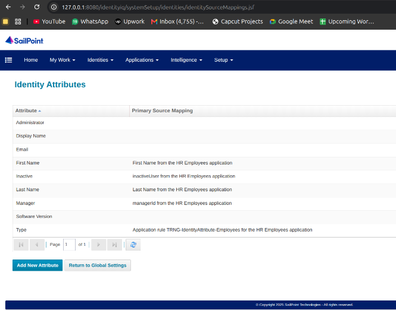
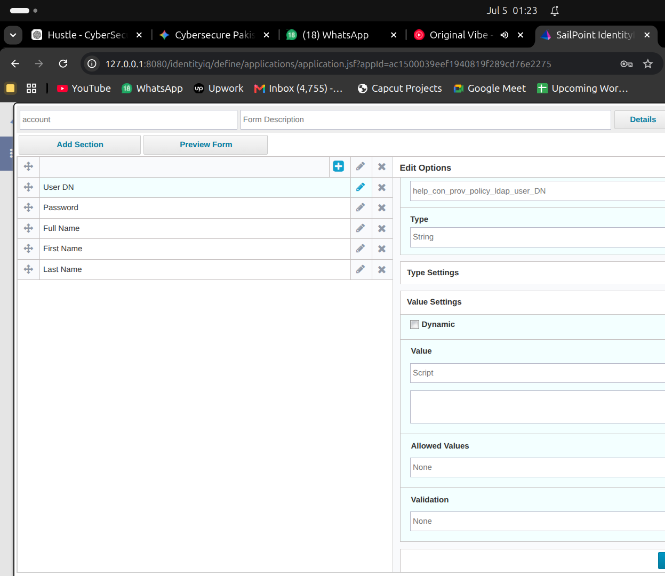
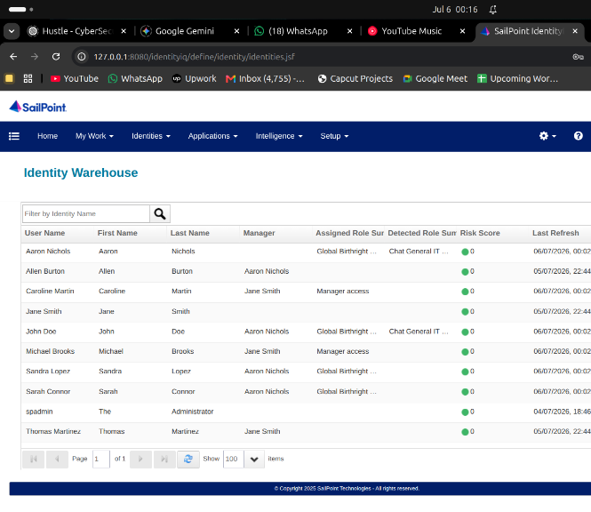
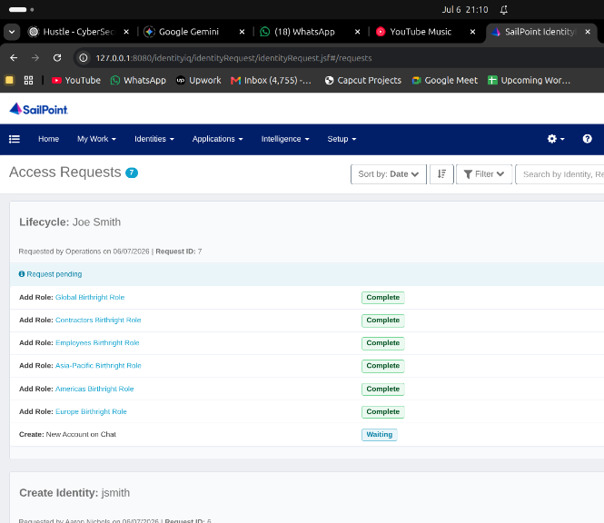

# Automated Joiner/Mover/Leaver Provisioning in SailPoint IIQ

## 🎯 Project Objective
The objective of this project was to design, deploy, and configure a fully functional SailPoint IdentityIQ (IIQ) 8.5 environment inside Docker, and completely automate the enterprise Identity Lifecycle (Joiner, Mover, Leaver) to demonstrate advanced Identity Governance and Administration (IGA) capabilities.

## 🛠️ Technologies Used
* **Identity Governance Engine**: SailPoint IdentityIQ 8.5
* **Infrastructure**: Docker, Tomcat, MySQL
* **Scripting & Automation**: Java / BeanShell, Python, Bash
* **Target Systems**: Active Directory (LDAP), MySQL (JDBC), Flat Files (Delimited CSV)
* **IAM Concepts**: RBAC, Lifecycle Management (LCM), Segregation of Duties (SoD), Provisioning Policies, Access Certifications

## 🏗️ Architecture & Design
This sandbox mimics a real-world enterprise architecture:
1. **Authoritative Sources**: `AuthEmployees.csv` and `AuthContractors.csv` serve as the HR databases, providing the initial identity truth.
2. **SailPoint IdentityIQ**: Acts as the central identity engine. It aggregates HR data, correlates accounts into Identity Cubes, evaluates RBAC rules, and triggers provisioning events.
3. **Target Endpoints**: 
   - A live LDAP Directory (simulating Active Directory).
   - A MySQL Database (simulating custom JDBC applications).
4. **Provisioning Engine**: Translates business logic (e.g., "HR Title changed to 'Inactive'") into automated downstream actions (e.g., "Disable LDAP account and scramble password").

## 🚀 Step-by-Step Implementation

### Phase 1: Environment Stand-Up & Connectivity
* Containerized the Tomcat application server and MySQL database to host the SailPoint IIQ WAR file.
* Executed SQL initialization scripts to build the underlying IdentityIQ schema (`setup_dbs.sql`).
* Configured SMTP integration for Rapid Setup email notifications.

### Phase 2: Application Onboarding & Correlation
* Onboarded `HR Employees` and `HR Contractors` as Delimited File applications.
* Configured an LDAP application (`ldap-data.ldif`) using the standard LDAP connector, establishing search DNs and group mapping.
* Authored **Correlation Rules** to automatically link disconnected LDAP and JDBC accounts to the correct human Identity Cube based on `employeeId` and `email` attributes.

### Phase 3: Role-Based Access Control (RBAC)
* Developed **Birthright Provisioning Policies** (`Roles-Birthright.xml`) to automatically grant base-level access (like IT VPN and Email) to all newly aggregated HR employees.
* Engineered Business and IT Roles (`Roles-Business_and_IT.xml`) for department-specific access.
* Wrote **BeanShell Rules** (`Rule-CreationRule-SetPassword.xml`) to dynamically generate initial passwords and username permutations during LDAP account creation.

### Phase 4: Lifecycle Management Automation (JML)
* **Joiner**: Configured Rapid Setup to catch new CSV aggregates, automatically creating LDAP and Time Tracking accounts.
* **Mover**: Built Attribute Sync rules so that when a user's `Location` changes in HR, the downstream Active Directory `l` attribute updates automatically.
* **Leaver**: Engineered a Leaver trigger listening for `inactive = True`. When detected, the system immediately fires an Identity Operation to disable the account, scramble the password, and strip all RBAC entitlements.

## 🚧 Challenges & Solutions
**Challenge**: During the Leaver automation phase, termination events were not properly firing when users were marked inactive in the HR CSV, leaving orphaned accounts active in the system.

**Solution**: By directly analyzing the `spt_identity` and `spt_task_definition` tables in the backend MySQL database using standard SQL queries, I discovered that the `Aggregate Employees` task was successfully flipping the `inactive` attribute, but the subsequent `Refresh with Process Events` task was missing the trigger. I navigated to the Global Settings -> Rapid Setup Configuration and discovered the Leaver Processing trigger was missing its explicit attribute mapping (`Inactive -> Changed To -> True`). Once configured and the Identity Operations Terminate flow was linked to the LDAP Application settings, the Leaver Request generated flawlessly.

## 📸 Visual Proof

### Identity Cubes & Correlation

*Successfully aggregating and correlating HR data into SailPoint Identity Cubes.*

### Provisioning Policies & Form Configuration

*Configuring dynamic field dependencies for Birthright Provisioning Forms.*

### Attribute Synchronization

*Testing Identity Attribute Synchronization from HR sources to downstream Active Directory targets.*

### Automated Leaver Provisioning Request

*The final result: SailPoint automatically generating a Leaver Request to strip the user's Manager Access role and queueing their downstream accounts for deletion upon termination.*
